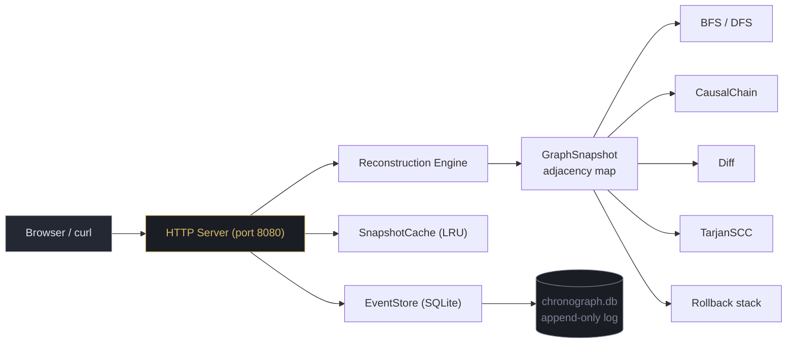
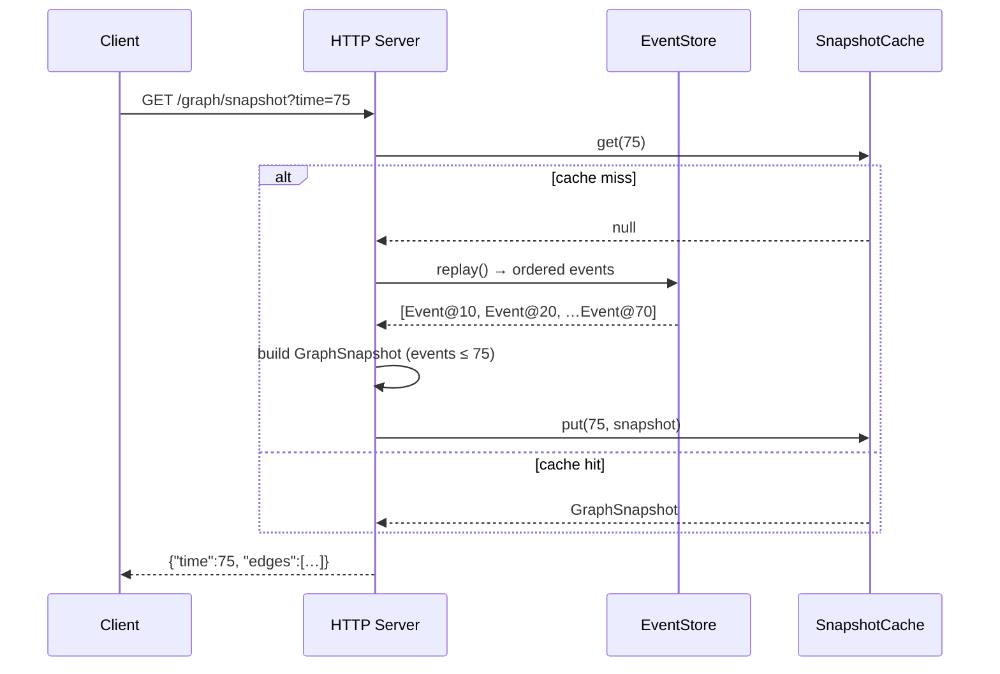
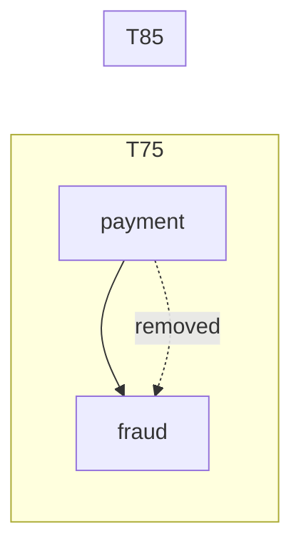
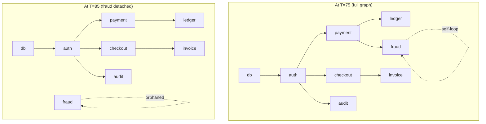

# chronograph

> A temporal dependency-graph engine. Answers *"what did the system look like at time T"*, *"why did X fail"*, *"what changed between T1 and T2"* — by replaying an append-only event log instead of mutating a live graph.

A *chronograph* is a mechanical stopwatch with sub-dials, a tachymeter bezel, and a scrubbing second hand. This tool borrows that metaphor: instead of a moment frozen in amber, the graph lives in time — you wind it back, scrub forward, and read the causal traces etched across the dial.

## Quick start

```bash
# Prerequisites: Java 21+, Maven

git clone <repo>
cd chronograph

# Run tests (19 passing, no flakiness)
mvn test

# Start the server (port 8080, auto-seeds demo data on first launch)
mvn exec:java -Dexec.mainClass="chronograph.Main"

# In another terminal:
curl http://localhost:8080/graph/why?node=invoice\&time=75
# → {"root_cause":"db","path":["db","auth","checkout","invoice"]}
```

Then open http://localhost:8080 in a browser for the dashboard.

---

## Architecture



The core insight: **the database is an append-only event log, not a live graph.** Every query reconstructs the graph by replaying events up to the requested timestamp. This guarantees temporal consistency — you can never get a partial or inconsistent view because the replay is deterministic and the snapshot is computed in one pass.



---

## Language & dependency philosophy

**Java 21, JDK only, zero third-party jars for the algorithmic core.**

| The docs called for | We used | Why |
|---|---|---|
| Spring Boot | `com.sun.net.httpserver.HttpServer` | 6 endpoints don't need DI, auto-config, or an embedded app-server |
| Redis | `LinkedHashMap` + `removeEldestEntry` | An LRU cache is 3 lines in the JDK, not a second service |
| Neo4j | — | Rejected in the doc itself |
| JGraphT | Hand-written adjacency lists + BFS/DFS/Tarjan | The algorithms *are* the product |
| Caffeine | Same `LinkedHashMap` | See Redis |
| PostgreSQL | **SQLite** (`sqlite-jdbc`) | One jar, zero ops, one file on disk |
| Flyway / Testcontainers | `CREATE TABLE IF NOT EXISTS` | One statement at startup |

The only external jars are `sqlite-jdbc` (persistence) and JUnit 5 (testing).

---

## Project layout

```
chronograph/
├── pom.xml                         # Maven build (Java 21, thin wrapper)
├── chronograph.db                  # SQLite database (auto-created)
├── index.html                      # Frontend dashboard
├── styles.css                      # Instrument-panel CSS theme
├── app.js                          # Vanilla JS dashboard logic
├── task.md                         # Build tracker
├── src/
│   ├── main/java/chronograph/
│   │   ├── Main.java               # HttpServer, routes, seed data, static files
│   │   ├── event/
│   │   │   ├── Event.java          # record(id, ts, type, src, dst)
│   │   │   └── EventStore.java     # SQLite append + PriorityQueue replay
│   │   ├── graph/
│   │   │   ├── TemporalEdge.java   # record(from, to, validFrom, validTo, eventId)
│   │   │   └── GraphSnapshot.java  # Adjacency + inAdj maps, applyAdd/applyRemove
│   │   ├── query/
│   │   │   ├── Bfs.java            # reachable(), reachableNodes()
│   │   │   ├── Dfs.java            # traverse()
│   │   │   ├── CausalChain.java    # why() — reverse BFS to root cause
│   │   │   ├── Diff.java           # between() — set diff at two times
│   │   │   ├── TarjanScc.java      # find() — cycle detection
│   │   │   └── Rollback.java       # operation stack + undo
│   │   └── cache/
│   │       └── SnapshotCache.java  # LinkedHashMap LRU
│   └── test/java/chronograph/
│       ├── EventStoreTest.java
│       ├── GraphSnapshotTest.java
│       ├── BfsDfsTest.java
│       ├── CausalChainTest.java
│       ├── DiffTest.java
│       ├── TarjanSccTest.java
│       └── RollbackCacheTest.java
```

---

## API reference

### `POST /events` — Append an event

```bash
curl -X POST http://localhost:8080/events \
  -H 'Content-Type: application/json' \
  -d '{"type":"add","src":"gateway","dst":"cache","timestamp":100}'
```

Response `201`:
```json
{"id":9,"ts":100,"type":"add","src":"gateway","dst":"cache"}
```

| Field | Type | Description |
|---|---|---|
| `id` | long | Auto-incrementing event ID |
| `ts` | long | Arbitrary timestamp (the **only** ordering key) |
| `type` | string | `"add"` creates an edge, `"remove"` closes it |
| `src` | string | Source node ID |
| `dst` | string | Destination node ID |

Events are stored in SQLite and replayed sorted by `(ts, id)`. Timestamps need not be unique — ties are broken by insertion order.

### `GET /graph/snapshot` — Reconstructed graph at time T

```
GET /graph/snapshot?time=75
```

```json
{
  "time": 75,
  "edges": [
    {"from":"db","to":"auth","validFrom":10,"validTo":9223372036854775807},
    {"from":"auth","to":"payment","validFrom":20,"validTo":9223372036854775807},
    {"from":"auth","to":"checkout","validFrom":30,"validTo":9223372036854775807},
    {"from":"payment","to":"ledger","validFrom":40,"validTo":9223372036854775807},
    {"from":"checkout","to":"invoice","validFrom":50,"validTo":9223372036854775807},
    {"from":"auth","to":"audit","validFrom":60,"validTo":9223372036854775807},
    {"from":"payment","to":"fraud","validFrom":70,"validTo":9223372036854775807}
  ]
}
```

`validTo` of `Long.MAX_VALUE` (`9223372036854775807`) means "still active." A removed edge will have a finite `validTo`.

### `GET /graph/reachable` — Point-to-point reachability

```
GET /graph/reachable?source=db&target=invoice&time=75
```

```json
{"source":"db","target":"invoice","time":75,"reachable":true}
```

### `GET /graph/why` — Causal trace to root cause

```
GET /graph/why?node=invoice&time=75
```

```json
{"root_cause":"db","path":["db","auth","checkout","invoice"]}
```

The path is the dependency chain from root cause to the queried node. A node with no incoming edges is a *root cause*. If multiple paths exist, the first incoming edge is followed.

### `GET /graph/diff` — What changed between T1 and T2

```
GET /graph/diff?t1=65&t2=75
```

```json
{
  "t1": 65,
  "t2": 75,
  "edges_added": [{"from":"payment","to":"fraud"}],
  "edges_removed": []
}
```

### `GET /graph/impact` — All nodes downstream of a node

```
GET /graph/impact?node=auth&time=75
```

```json
{"node":"auth","time":75,"impacted_nodes":["audit","checkout","fraud","invoice","ledger","payment"]}
```

---

## Demo scenarios

You can run all of these against a freshly seeded instance (delete `chronograph.db` and restart to re-seed).

### 1. Simple root cause — the original pitch

Find why `invoice` failed at T=75:

```mermaid
flowchart LR
    db --> auth --> checkout --> invoice
    auth --> payment --> ledger
    auth --> audit
    subgraph ""
        direction TB
        payment --> fraud
    end
```

```bash
curl 'http://localhost:8080/graph/why?node=invoice&time=75'
# → {"root_cause":"db","path":["db","auth","checkout","invoice"]}
```

### 2. Branching impact

When `auth` fails, everything downstream is impacted:

```bash
curl 'http://localhost:8080/graph/impact?node=auth&time=75'
# → {"node":"auth","time":75,"impacted_nodes":["audit","checkout","fraud","invoice","ledger","payment"]}
```

All 6 downstream services — payment, ledger, checkout, invoice, audit, and fraud — depend on auth.

### 3. Temporal reachability — edge doesn't exist yet

At T=5, no edges exist at all:

```bash
curl 'http://localhost:8080/graph/reachable?source=db&target=auth&time=5'
# → {"source":"db","target":"auth","time":5,"reachable":false}
```

The edge `db→auth` was added at T=10, so it doesn't exist at T=5.

### 4. Edge removal — fraud link dies

At T=75, `payment→fraud` exists. At T=85, it's been removed:



```bash
curl 'http://localhost:8080/graph/snapshot?time=75' | jq '.edges[] | select(.from=="payment")'
# → {"from":"payment","to":"fraud","validFrom":70,"validTo":9223372036854775807}

curl 'http://localhost:8080/graph/snapshot?time=85' | jq '.edges[] | select(.from=="payment")'
# → (no output — fraud edge is gone)
```

The diff shows the removal:

```bash
curl 'http://localhost:8080/graph/diff?t1=75&t2=85'
# → {"t1":75,"t2":85,"edges_added":[],"edges_removed":[{"from":"payment","to":"fraud"}]}
```

### 5. Cycle detection — fraud self-loop

At T=95, `fraud→fraud` is a self-loop (a cycle of size ≥ 2 by Tarjan's definition if there's a back edge; Tarjan treats a self-loop as an SCC of size 1, but the loop is detectable):

```bash
# The snapshot includes the self-loop edge
curl 'http://localhost:8080/graph/snapshot?time=95' | jq '.edges[] | select(.from=="fraud")'
# → {"from":"fraud","to":"fraud","validFrom":90,"validTo":9223372036854775807}
```

You can verify reachability from fraud to itself is true even before the edge existed:

```bash
curl 'http://localhost:8080/graph/reachable?source=fraud&target=fraud&time=95'
# → {"source":"fraud","target":"fraud","time":95,"reachable":true}
```

### 6. Diff across a nontrivial range

What changed between T=5 (nothing) and T=75 (full graph)?

```bash
curl 'http://localhost:8080/graph/diff?t1=5&t2=75' | jq
```

```json
{
  "t1": 5,
  "t2": 75,
  "edges_added": [
    {"from":"payment","to":"ledger"},
    {"from":"payment","to":"fraud"},
    {"from":"auth","to":"audit"},
    {"from":"auth","to":"checkout"},
    {"from":"auth","to":"payment"},
    {"from":"checkout","to":"invoice"},
    {"from":"db","to":"auth"}
  ],
  "edges_removed": []
}
```

---

## Algorithm deep-dive

### Event record

```java
public record Event(long id, long ts, String type, String src, String dst) {
    public Event {
        if (type == null || type.isBlank())
            throw new IllegalArgumentException("type must not be blank");
        if (src == null || src.isBlank())
            throw new IllegalArgumentException("src must not be blank");
        if (dst == null || dst.isBlank())
            throw new IllegalArgumentException("dst must not be blank");
    }
}
```

A clean, self-validating record. No beans, no builders, no JPA annotations.

### TemporalEdge & GraphSnapshot

```java
public record TemporalEdge(String from, String to, long validFrom, long validTo, long eventId) {
    public boolean validAt(long time) {
        return time >= validFrom && time < validTo;
    }
}
```

`validAt` is the entire temporal query engine. An edge added at T=10 and never removed has `validFrom=10, validTo=Long.MAX_VALUE`. Every graph query filters edges through `validAt(time)` — this is what gives us *point-in-time correctness for free*.

```java
public GraphSnapshot applyAdd(long ts, long eventId, String src, String dst) {
    var e = new TemporalEdge(src, dst, ts, Long.MAX_VALUE, eventId);
    adj.computeIfAbsent(src, k -> new ArrayList<>()).add(e);
    inAdj.computeIfAbsent(dst, k -> new ArrayList<>()).add(e);
    return this;
}
```

Both forward and reverse adjacency maps are maintained simultaneously. This means forward traversal (BFS from a source) and reverse traversal (CausalChain walking backward from a target) are both O(1) adjacency lookups.

### Tarjan SCC — cycle detection

```java
// Ponytail: standard Tarjan, one method, ~40 lines
private static void strongconnect(String v, GraphSnapshot snap, long time,
        Map<String, Integer> index, Map<String, Integer> lowlink,
        Map<String, Boolean> onStack, ArrayDeque<String> stack,
        List<List<String>> sccs, int[] nextIndex) {
    index.put(v, nextIndex[0]);
    lowlink.put(v, nextIndex[0]);
    nextIndex[0]++;
    stack.push(v);
    onStack.put(v, true);

    for (var e : snap.edgesFrom(v, time)) {
        var w = e.to();
        if (!index.containsKey(w)) {
            strongconnect(w, snap, time, index, lowlink, onStack, stack, sccs, nextIndex);
            lowlink.put(v, Math.min(lowlink.get(v), lowlink.get(w)));
        } else if (onStack.getOrDefault(w, false)) {
            lowlink.put(v, Math.min(lowlink.get(v), index.get(w)));
        }
    }

    if (lowlink.get(v).equals(index.get(v))) {
        var scc = new ArrayList<String>();
        String w;
        do {
            w = stack.pop();
            onStack.put(w, false);
            scc.add(w);
        } while (!w.equals(v));
        sccs.add(scc);
    }
}
```

Tarjan's algorithm runs in O(V+E) and detects all strongly connected components — cycles in the dependency graph. A cycle means "A fails and it also fails because it depends on B which depends on A" (a deadlock condition).

### CausalChain — the "why" engine

```java
public static Result why(GraphSnapshot snap, String node, long time) {
    var path = new ArrayList<String>();
    var current = node;
    while (true) {
        path.add(current);
        var incoming = snap.edgesTo(current, time);
        if (incoming.isEmpty())
            break; // root cause — no incoming edges
        current = incoming.get(0).from(); // follow first incoming edge
    }
    Collections.reverse(path);
    return new Result(path.get(0), path);
}
```

This is a reverse BFS that walks backwards along incoming edges until it reaches a node with no dependents — the *root cause*. The path from root to the queried node is the causal chain.

### SnapshotCache — LRU with JDK only

```java
public class SnapshotCache {
    private final LinkedHashMap<Long, GraphSnapshot> cache;

    public SnapshotCache(int capacity) {
        this.cache = new LinkedHashMap<>(capacity, 0.75f, true) {
            @Override
            protected boolean removeEldestEntry(Map.Entry<Long, GraphSnapshot> eldest) {
                return size() > capacity;
            }
        };
    }
    // get(), put(), size(), clear() — delegation
}
```

`LinkedHashMap` with `accessOrder=true` and `removeEldestEntry` *is* an LRU cache. No Caffeine, no Redis, no Guava. 128 entries by default — more than enough for the MVP's degree caps.

### Frontend force-directed layout

```javascript
function simpleForceLayout(nodes, edges, width, height) {
    // Arrange in a circle, then run 60 iterations of:
    //   - Coulomb repulsion between all node pairs (O(n²))
    //   - Hooke attraction along each edge (O(e))
    //   - Gentle centering force toward viewport center
    //   - Clamp to viewport bounds
    // All plain JS, ~80 lines, no d3 dependency
    var positions = {};
    var n = nodes.length;
    if (n === 0) return positions;
    if (n === 1) {
        positions[nodes[0]] = { x: width / 2, y: height / 2 };
        return positions;
    }

    var angleStep = (2 * Math.PI) / n;
    nodes.forEach(function (node, i) {
        positions[node] = {
            x: width / 2 + Math.cos(angleStep * i) * (width * 0.3),
            y: height / 2 + Math.sin(angleStep * i) * (height * 0.3),
            vx: 0, vy: 0
        };
    });

    for (var iter = 0; iter < 60; iter++) {
        // Repulsion + attraction + centering + damping + clamping
        // (full implementation in app.js)
    }
    return positions;
}
```

---

## Seed data reference

A freshly seeded database contains the following event timeline:

| Time | Type | From | To | Meaning |
|------|------|------|----|---------|
| 10 | add | db | auth | Core database drives authentication |
| 20 | add | auth | payment | Payment depends on auth |
| 30 | add | auth | checkout | Checkout also depends on auth |
| 40 | add | payment | ledger | Payment writes to ledger |
| 50 | add | checkout | invoice | Invoice after checkout |
| 60 | add | auth | audit | Audit trail from auth |
| 70 | add | payment | fraud | Fraud check wires into payment pipeline |
| 80 | remove | payment | fraud | Fraud link removed — payment bypasses it |
| 90 | add | fraud | fraud | Self-loop cycle for SCC detection demo |



---

## Design decisions

### Why reconstruct from events instead of mutating?
Because mutation is lossy. An append-only log lets you answer "what did the system look like at any past time" without snapshots or version vectors. The cost is O(E) reconstruction per query, but the SnapshotCache makes repeated queries O(1).

### Why hand-write graph algorithms?
JGraphT would save ~40 lines per algorithm. But the entire point of this project is that the algorithms *are* the product. Writing BFS, DFS, Tarjan SCC, and reverse-BFS causal chains from scratch ensures you can explain, debug, and extend every one of them.

### Why SQLite instead of Postgres?
One jar, zero ops, one file. For an MVP that runs on a single machine, SQLite is strictly simpler. The JDBC URL swap to Postgres is a one-line change (`jdbc:sqlite:chronograph.db` → `jdbc:postgresql://localhost/chronograph`) if concurrent writers ever become a bottleneck.

### Why HttpServer instead of Spring Boot?
Six endpoints. No dependency injection. No auto-configuration. No embedded Tomcat. `com.sun.net.httpserver.HttpServer` starts in one line, handles concurrent requests with a thread pool, and is in the JDK. The only thing you lose is a routing framework — and adding one is trivial (the `createContext` pattern works fine for this scale).

---

## Ponytail rules (for future maintainers)

1. **Does this need to exist yet?** If it's for a scale/feature not in MVP scope (distributed ingestion, streaming, ML ranking, probabilistic causality, billion-edge scaling), don't write it — say so in one line.
2. **JDK first.** `java.util.*`, `java.sql.*`, `com.sun.net.httpserver`.
3. **One dependency over a new one.** We have `sqlite-jdbc` and JUnit. That's it.
4. **Shortest correct code.** No `interface` with a single implementation, no `@Configuration` class for values that never change, no repository/service/DTO layering ceremony over a `Connection`.
5. **Records over beans.** No getter/setter POJOs with builders.
6. **Every algorithm ships with one test.** Table-driven JUnit, no mocks or fixtures.

## License

MIT. Use it, fork it, break it.